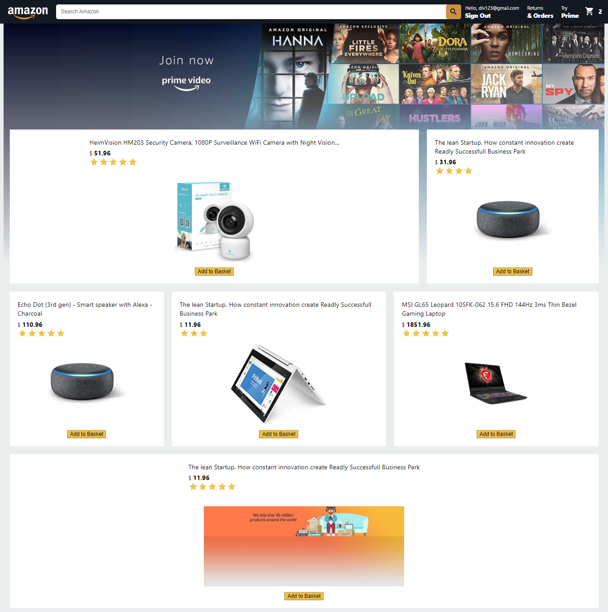

# Amazon Clone

Amazon Clone Using ReactJs, React Context API and Firebase

## Features

1. Create Account, Log in and Log out Section. (Used Firebase to Sign up and log in)
2. Display Email Address on home page after log in
3. Add items to the Cart
4. Dynamically Calculate Total of the Added Items.
5. List of the Added Items on the Checkout page

## Built With

- ReactJs
- React Context API
- Firebase
- HTML
- CSS
- Material-UI

## Live Demo

[Live Demo Link](https://clone-webapp.web.app/)

## Getting Started

To get local copy up and running in your local machine follow this simple step:

## Install

To install some of the required packages in your local machine

- clone the repository
- in your terminal type `yarn install`

## Run Test

`yarn start`

## Author

👤 **Mian Faizan Ali Full Stack Programmer**

- GitHub: [@Faizanalifullstackprogrammer](https://github.com/Faizanalifullstackprogrammer)
- Twitter: [@mianfaizanali](https://twitter.com/mianfaizanali)
- LinkedIn: [Mianfaizanali](https://pk.linkedin.com/in/mianfaizanali)

## 🤝 Contributing

Contributions, issues, and feature requests are welcome!

Feel free to connect anytime

## :handshake: Contributing

Contributions, issues, and feature requests are welcome!

Feel free to check the [issues page](https://github.com/Div685/React-Amazon-Clone-webApp/issues).

## Show your support

Give a :star: if you like this project

## Acknowledgments
- [Material-Ui](https://material-ui.com/components/material-icons/) for its Awesome Icons

## License

This page is [MIT](https://github.com/Div685) licence
